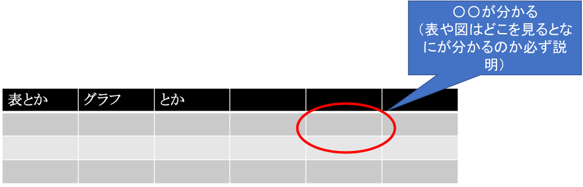

<!-- _class: title -->
# タイトル

## サブタイトル（あれば）

### 千葉工業大学 上田研究室（学内なら研究室と学番）

### 名前

---
<!--_class: normal-->

# 背景: 〇〇〇〇

- 世の中で何が問題になっているのかを書く
- 注意
  - 字は24ポイントを下回らないこと
  - 箇条書きには構造を持たせる
    - 大項目に細かい話をインデントしてぶら下げ
  - 箇条書きは7行まで
  - 可能な限り体現止めで

<div class="conclusion">
スライドのまとめを書く<br>
（次のページの関連研究に話をつなげる．例「〇〇の解決が必要」など）
</div>

---
<!--_class: normal-->
# 従来研究1: 〇〇〇〇

- ××手法によるyyの解決[上田2020]
  - hoge
  - hoge

<div class="conclusion">
△△が未解決
</div>

<div class="top-right-image" style="top: 420px; right: 200px;">
  
</div>

---
<!--_class: normal-->

# 従来研究2: 〇〇〇〇

- 従来研究1と同じ構成で
  - 複数の従来研究を1枚にまとめるのも可

<div class="conclusion">
△△が未解決
</div>

<div class="top-right-image" style="top: 420px; right: 200px;">
  
</div>

---
<!--_class: normal-->

# △△の提案

- 従来研究で残った問題に対して，こうするとよいということをなるべく具体的に記述
- 本発表では（この箇条書きで提案した△△をどう具現化して有効性を証明するかを説明）
  - 〇〇の実装
  - 実世界で適用できるか実験

---
<!--_class: normal-->

# 研究目的

<div class="purpose">
△△の実現のための<br>〇〇の実装と評価
</div>

---
<!--_class: normal-->

# 〇〇の実装

- 実装したものをなるべく文字数少なく具体的に説明

---
<!--_class: normal-->

# 実験: □□の評価

- なにを実験で証明すればよいのかを書く
- そのためにどういう実験をしたのかを書く
  - 実験条件1
  - 実験条件2

---
<!--_class: normal-->

# 結果

- 前ページの実験結果を記述

<br><br><br>

<div class="center-image" style="top: 18%;">
  
</div>

- 考察
  - 実験からわかること1
  - 実験からわかること2

<div class="conclusion">
目的は達成されたのかどうなのか総括
</div>

---
<!--_class: normal-->

# 結論

- 本研究では△△を実現するために〇〇を提案した
- 実験で達成されたことを書く（目的と一貫性があること！）
  - 細かい結果

- 今後の展望
  - △△のさらなる改善
  - 〇〇の応用

---
<!--_class: normal-->

# 参考文献

[上田 2020] 上田隆一,“xxxxのためのyyyyなzzzzを用いた〇〇アルゴリズム”, \
&nbsp;&emsp;&emsp;&nbsp;&nbsp;&nbsp;&nbsp;&nbsp;&nbsp;&nbsp;&nbsp;&nbsp;&nbsp;&nbsp;&nbsp;第 XX 回△△講演論文集, pp. AAA-BBB, 2020.

---
<!--_class: normal-->

# 画像の貼り方オプション1

## 中央揃えで上下を可変

<br>
<br>

```
<div class="center-image" style="top: 20%;">
  
</div>
```

<div class="center-image" style="top: 20%;">
  
</div>

---
<!--_class: normal-->

# 画像の貼り方オプション2

## 任意の位置
- 上端と右端から位置を決定
  - 指定しなければ, 初期値は
  `top: 120px; right: 50px;`

<br>
<br>
<br>

```
<div class="top-right-image" style="top: 420px; right: 450px;">
  
</div>
```

<div class="top-right-image" style="top: 420px; right: 450px;">
  
</div>
<div class="top-right-image">
  
</div>

---

<!--_class: normal-->
$$\newcommand{\V}[1]{\boldsymbol{#1}}$$
$$\newcommand{\jump}[1]{[\![#1]\!]}$$
$$\newcommand{\bigjump}[1]{\big[\!\!\big[#1\big]\!\!\big]}$$
$$\newcommand{\Bigjump}[1]{\bigg[\!\!\bigg[#1\bigg]\!\!\bigg]}$$

# 数式の表現

```
$$\newcommand{\V}[1]{\boldsymbol{#1}}$$
$$\newcommand{\jump}[1]{[\![#1]\!]}$$
$$\newcommand{\bigjump}[1]{\big[\!\!\big[#1\big]\!\!\big]}$$
$$\newcommand{\Bigjump}[1]{\bigg[\!\!\bigg[#1\bigg]\!\!\bigg]}$$
```

- 信念分布: $b_t(\V{x}) = p_t(\V{x} | \V{x}_0, \V{u}_{1:t}, \textbf{z}_{1:t})$
  - `$b_t(\V{x}) = p_t(\V{x} | \V{x}_0, \V{u}_{1:t}, \textbf{z}_{1:t})$`

---

<!--_class: normal-->

$$
\begin{equation}
  \min\Big\{ \mathcal{E}_{s, \alpha}(E) \coloneqq P_s(E) + 
  \int_{E}\int_{E} \frac{1}{|x-y}^{\alpha} \, dxdy \mid |E| = m \Big\}
\end{equation}
$$

```
$$
\begin{equation}
  \min\Big\{ \mathcal{E}_{s, \alpha}(E) \coloneqq P_s(E) + 
  \int_{E}\int_{E} \frac{1}{|x-y}^{\alpha} \, dxdy \mid |E| = m \Big\}
\end{equation}
$$
```
